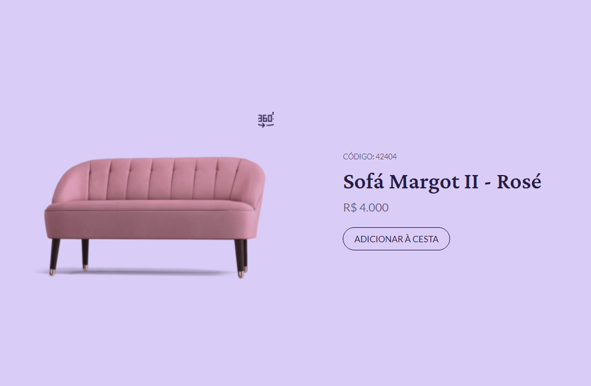

# cardProd
my simple music player page for learn HTML, CSS

 
## | 🛠 &nbsp;Tech Stack | ##
 
Projeto desenvolvido durante o desafio #boraCodar um card de produto da Rocketseat!

Utilisei html, css e js para troca da imagem por um gif, e uma animação simples usitilizando animation css.

&nbsp;
&nbsp;
&nbsp;

 

 
